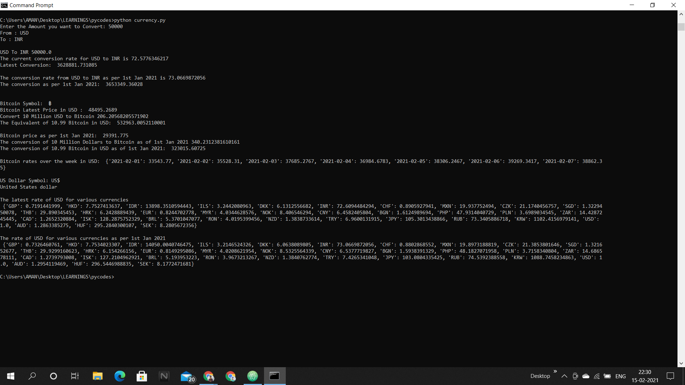
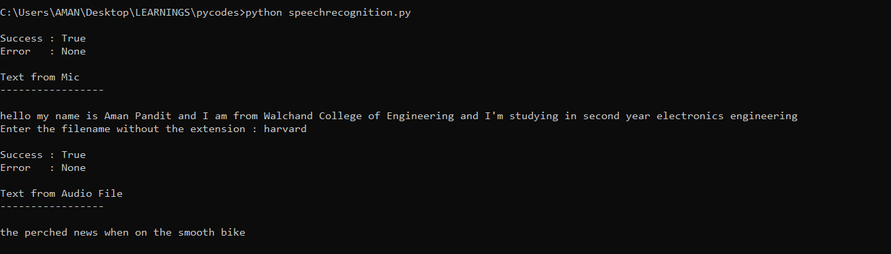

# Python_Project

## 1) [Audio Book](https://github.com/amanpanditap/Python_Projects/tree/main/audiobook)
A Python script that can be used to convert a pdf into an audiobook. 
with the help of pyttsx3 library to convert text into speech. 
Note: The pdf file and python script should be in same folder 
To run use : `python audiobook.py`

## 2) [Automate Email](https://github.com/amanpanditap/Python_Projects/tree/main/autoemail)
Send Email using python code. 
Check out the code for instructions, also configure your Email 
Steps for configuration(Do at your own will!!) 
i) While logged into your gmail at gmail.com, go to https://myaccount.google.com/security 
ii) Scroll down to the part that says "Allow less secure apps" 
iii) Turn ON "allow less secure apps". 
If you don't want to make your main gmail less secure, or if you don't already have gmail, then sign up for a new gmail solely for this purpose.

## 3) [Covid19 Analysis](https://github.com/amanpanditap/Python_Projects/tree/main/covid19_analysis)
Datasets: https://data.humdata.org/dataset/novel-coronavirus-2019-ncov-cases

Command to Run: `python covid_analysis.py` 

Dataset was downloaded on 9th August 2021.

## 4) [Currency_Converter](https://github.com/amanpanditap/Python_Projects/tree/main/currency_converter)
Convert currencies and bitcoin using python script in command line.  
Check out the results: 

## 5) [Face-Detection using Open-CV](https://github.com/amanpanditap/Python_Projects/tree/main/facedetection)
You can detect multiple faces, eyes and smile using open cv either from an image, webcam or saved video file. 
Check out the results for images and video in the folder for analysis. 
Make sure that you have done all the installations properly. 
To detect face in an image: Run `python facedetection-image.py` 
To detect face from webcam or saved video file: Run `python facedetection-video.py` 

## 6) [Finance_Python](https://github.com/amanpanditap/Python_Projects/tree/main/finance_python)
Finance based application using Python & its libraries. 
- Balance Sheet Analysis
- Candlestick_Chart
- Crypto / Stock Analysis
- Crypto / Stock Visualizer
- Portfolio Visualizer
- Stock / Crypto Prediction 
- Stock Screener
- Technical Stock Analysis (RSI)

## 7) [Graph Composer Master](https://github.com/amanpanditap/Python_Projects/tree/main/graph-composer-master)
This makes a random paragraph of desired length from any text file such as songs lyrics or movie subtitles, it uses graph and selects words as per their weights. 
It includes the implementation of Markov Chain 
To run use : `python compose.py`

## 8) [Hangman](https://github.com/amanpanditap/Python_Projects/tree/main/hangman)
It is a simple game to guess the letter in a word with a specific number of lives available to guess. 
To run use: `python hangman.py`

## 9) [Latest News](https://github.com/amanpanditap/Python_Projects/tree/main/latest-news)
Get the latest news from all over the world by just running a python script. 
Note: Make sure that you have the BeautifulSoup library

## 10) [Minesweeper](https://github.com/amanpanditap/Python_Projects/tree/main/minesweeper)
Command line Minesweeper game.

## 11) [Pillow](https://github.com/amanpanditap/Python_Projects/tree/main/pillow)
Learnt Python Imaging Library.
Check the codes for more details.
Go through Jupyter Notebook for a better readibility.
To run use: `python pillow.py test.jpg`

## 12) [Photoshop](https://github.com/amanpanditap/Python_Projects/tree/main/pyphotoshop)
It is a photo editing project which takes particular image as input then as per the requirement adjusts its brightness, contrast, blur, darkens, edge detection kernel, and combines 2 images and then gives the output image. 
Note: Use version below than Python 3.9 for running this, suggested Python 3.8. 
To run use: `python transform.py`

## 13) [Reminder](https://github.com/amanpanditap/Python_Projects/tree/main/reminder)
Get a reminder on your desktop as per your wish with a beep sound!

## 14) [Python - Simple Math Interpreter](https://github.com/amanpanditap/Python_Projects/tree/main/simple_math_interpreter)

An interpreter, written from scratch in Python, that can evaluate simple math calculations.

This is useful for learning how computers process human-readable text and is a great first step to creating your own programming language, data language, etc.

The user input is analyzed in two sections of code called the lexer and parser, before finally being interpreted by the interpreter.

- Run: `python main.py`

Credits to [CodePulse](https://www.youtube.com/channel/UCUVahoidFA7F3Asfvamrm7w) for the Simple Math interpreter written in Python

## 15) [SpeechRecognition](https://github.com/amanpanditap/Python_Projects/tree/main/speechrecognition)

Speech to Text Conversion in python using speech_recognition. 
Install it using : `pip install SpeechRecognition` 
Check the codes for detailed guidelines.  
Here is a sample result: 

## 16) [Soduku](https://github.com/amanpanditap/Python_Projects/tree/main/sudoku)
Solves the soduku puzzle and gives the output using backtracking.

## 17) [TextEditor](https://github.com/amanpanditap/Python_Projects/tree/main/texteditor)
An elegant, yet simple, text editor made with Python and wxPython. 
Install wxPython by using: `pip install wxPython`  
Check out the results: 

## 18) [TicTacToe](https://github.com/amanpanditap/Python_Projects/tree/main/tictactoe)
Play TicTacToe against Smart Computer which is almost undefeatable, challenge yourself by defeating the Computer, It uses Minimax algorithm. 
To run use: `python game.py`

## 19) [Url-Shortener](https://github.com/amanpanditap/Python_Projects/tree/main/url_shortener)
Shorten all the urls using tinyurl API. 
You can enter multiple links(1000+ without getting crashed) in a text file at once to shorten it or just simply take it as an input or just directly code the url which you want to shorten. 
url_shortener.py is the library file for URL shortening. 
Run python main_script.py to get the desired results. 
Note: Make sure that the ‘url_shortener.py’ file is available in the same working directory as main_script.py. 
If you don't wish to use 'main_script.py' file then you can still run the code and get the shortened url by running this command `python url_shortener.py add_your_link_here`

## 20) [Wikipedia](https://github.com/amanpanditap/Python_Projects/tree/main/wikipedia)
Get the summary, search, images, links, and many more features of wikipedia article directly through one of the python libraries. 
Check out the code for explanation and working.
