# Covid19 Analysis

## Results 

- Total Confirmed Cases 
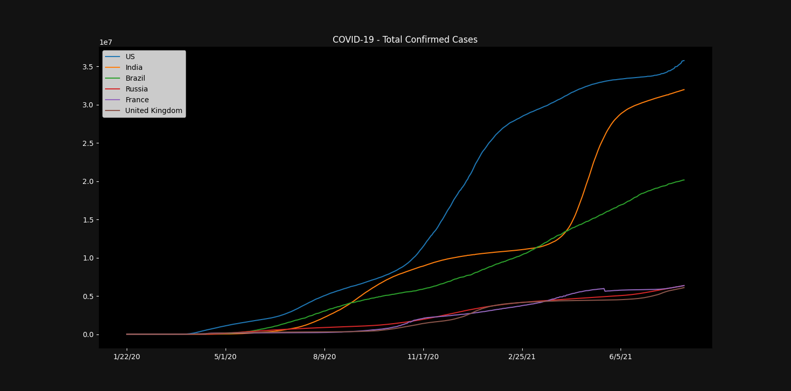

- Total Recovery Reported 
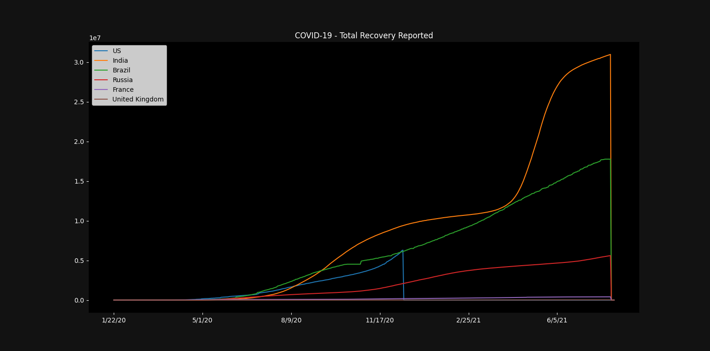

- Total Deaths Reported 
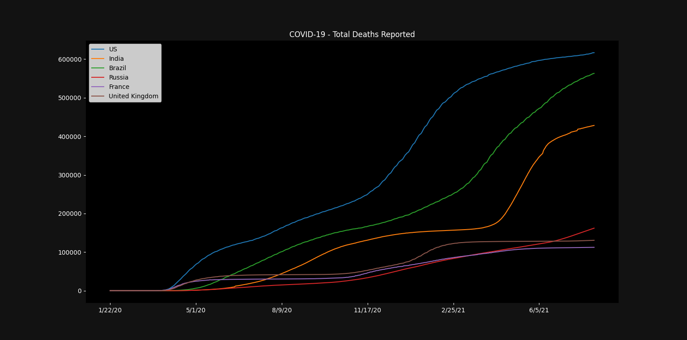

## India - Statistics

- New Cases

 Zoomed 
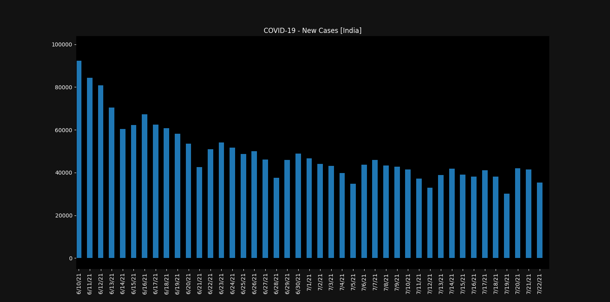

- Growth Rate
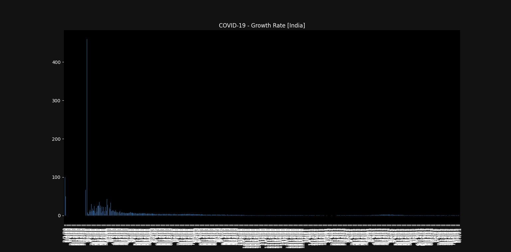

 Zoomed 
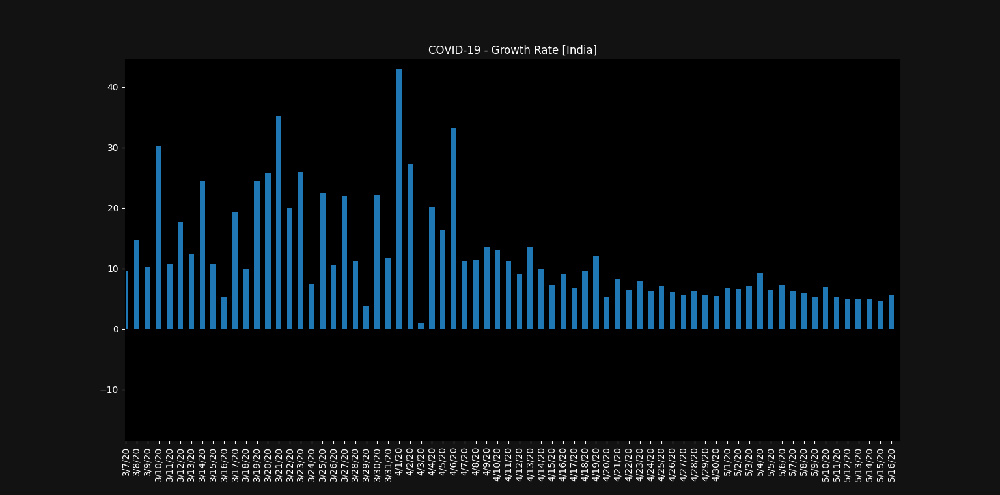

- Active Cases

 Zoomed 
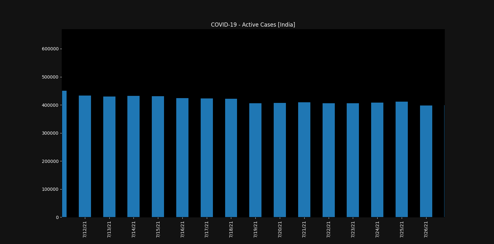

- Overall Growth Rate
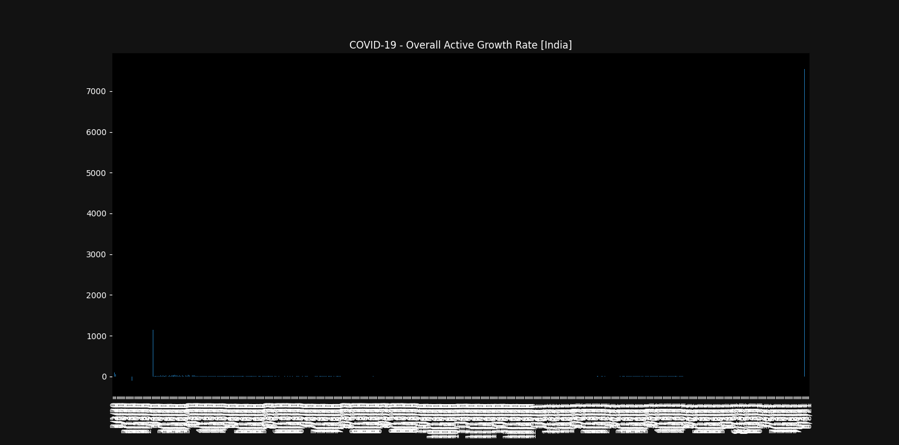

 Zoomed 
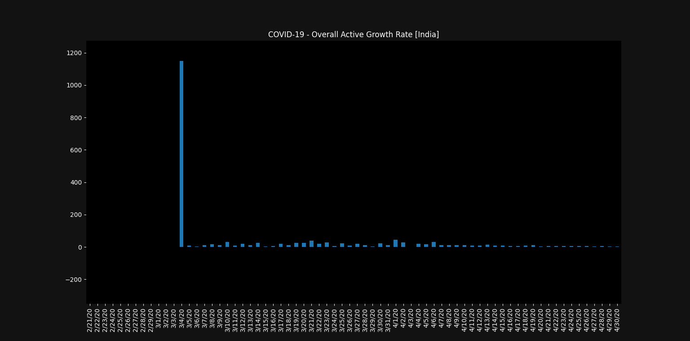

- Death Rate
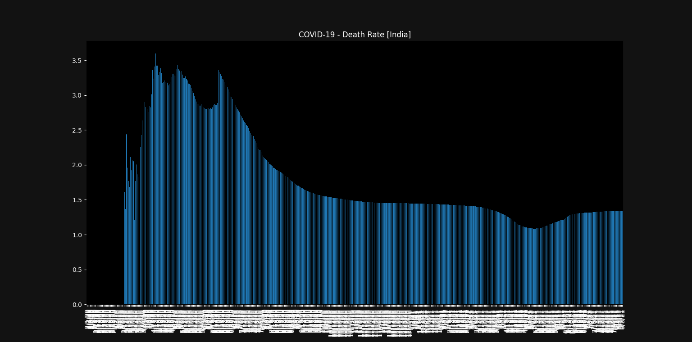

 Zoomed 
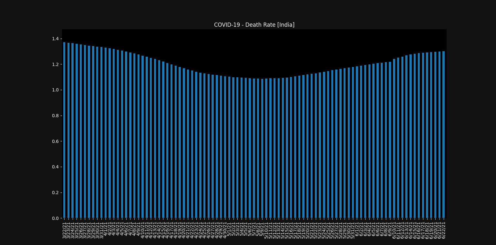

- Hospitalization Needed
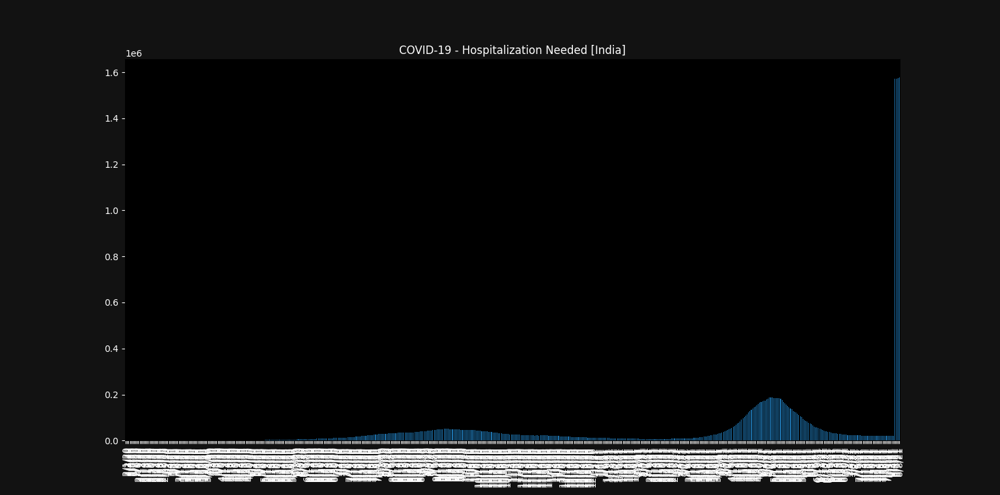

 Zoomed 
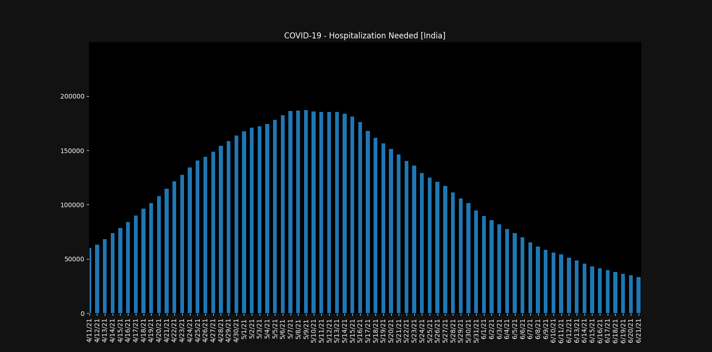

- Simulation: constant 2% growth rate
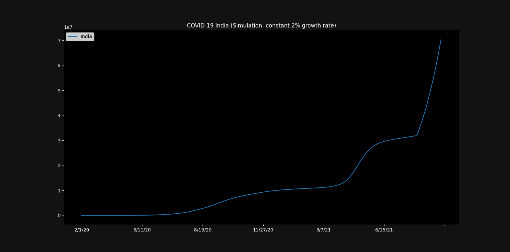