# Finance Python

## [Algorithmic Trading](https://github.com/amanpanditap/Python_Projects/tree/main/finance_python/algorithmic_trading)
For a particular stock, the plotted graph shows when to Buy / Sell a stock as per the moving averages.

Command to Run: `python algorithmic_trading.py` 

- Results 
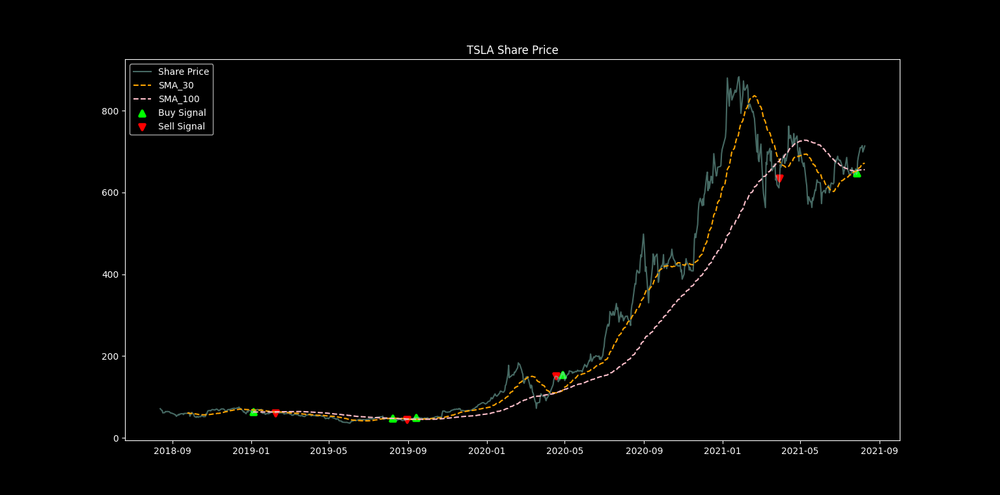

Note: Enter proper ticker name to avoid errors.

## [Balance Sheet Analysis](https://github.com/amanpanditap/Python_Projects/tree/main/finance_python/balance_sheet_analysis)

Command to Run: `python balance_sheet_analysis.py` 

- Results 
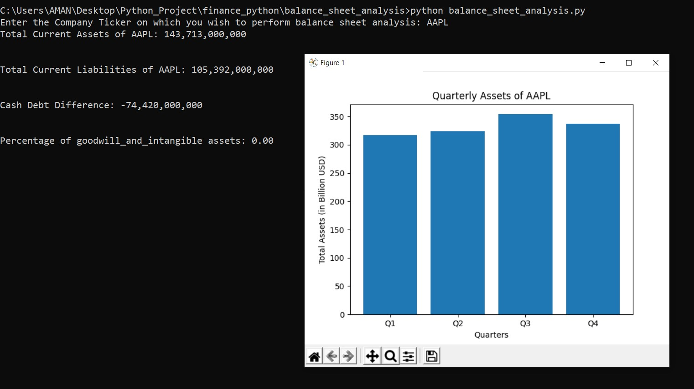

Note: Enter proper ticker name to avoid errors.

## [Candlestick Charts](https://github.com/amanpanditap/Python_Projects/tree/main/finance_python/candlestick_chart)
Candlestick charts are used by traders to determine possible price movement based on past patterns. Candlesticks are useful when trading as they show four price points (open, close, high, and low) throughout the period of time the trader specifies. 

- Candlestick Chart: 
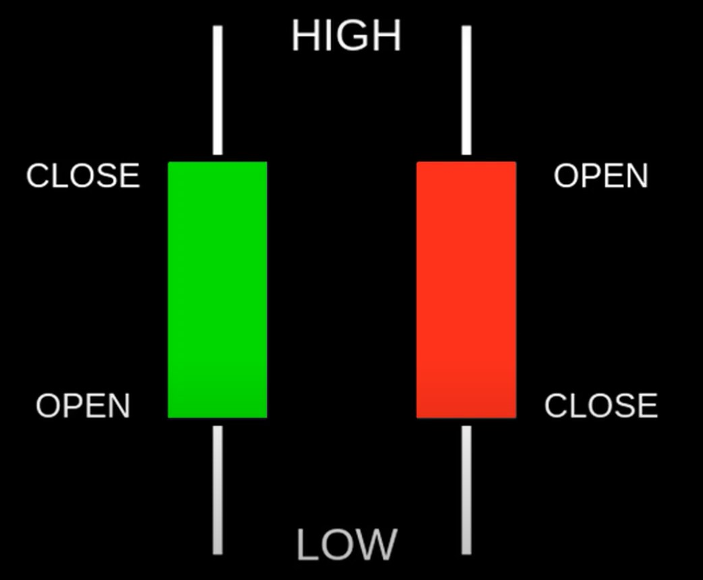

Command to Run: `python candlestick_chart.py` 

- Results 
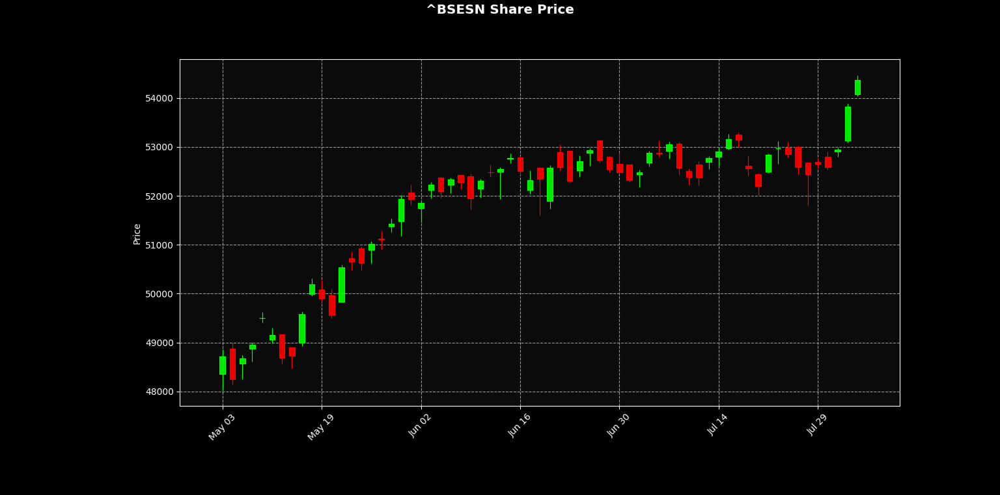

Note: Enter proper ticker name to avoid errors.

## [Crypto / Stock Analysis](https://github.com/amanpanditap/Python_Projects/tree/main/finance_python/crypto_analysis)
Analyse Cryptocurrencies or Stocks. 

Correlation is a term from mathematical statistics that describes the strength of linear relationship between the variables (in our case: financial instruments).

Simply speaking, it describes whether or not instruments move in same/opposite directions.

The darker the color, the stronger the correlation 
Green colors mean positive correlations 
Red colors mean negative correlations 
Transparent colors mean no correlation or absence of the symbol data 

Command to Run: `python crypto_analysis.py` 

- Crypto Analysis Results

- Stock Analysis Results
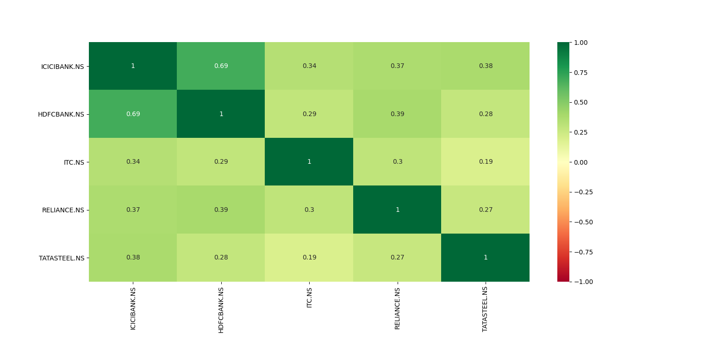

Note: Enter proper ticker name to avoid errors.

## [Crypto / Stock Visualizer](https://github.com/amanpanditap/Python_Projects/tree/main/finance_python/crypto_visualizer)
Visualize Crypto Coin value in the desired currency. 
Scale adjusted to Logarathmic for a good visualization.

Command to Run: `python crypto_visualizer.py` 

- Crypto Visualizer Results 
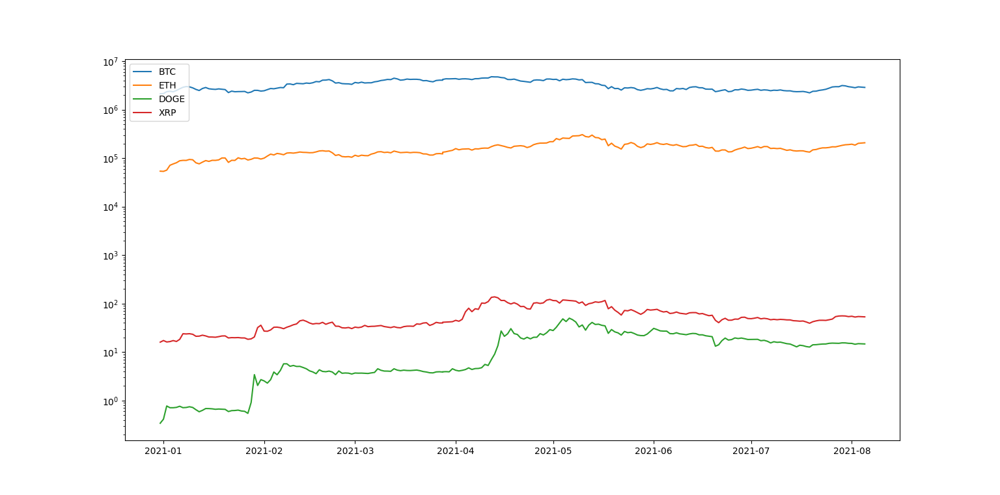

- Stock Visualizer Results 
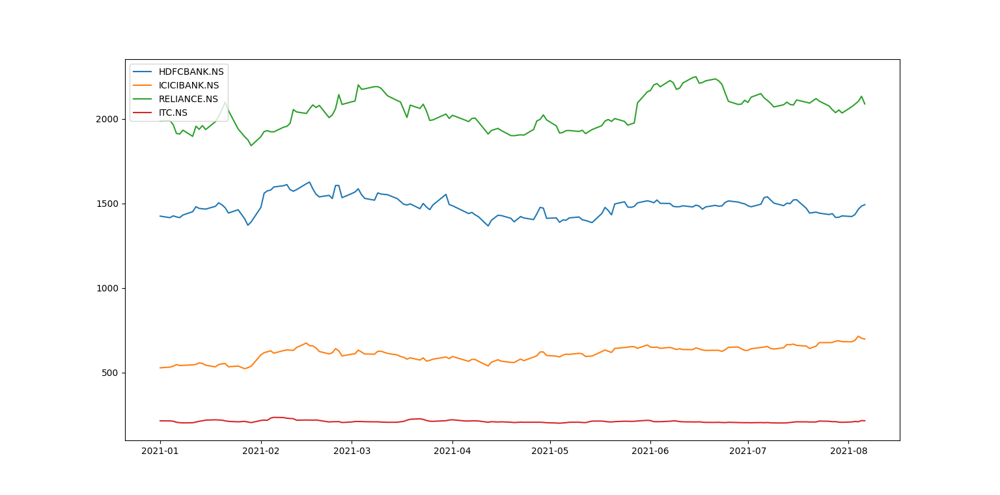

Note: Enter proper ticker and curreny name to avoid errors.

## [Portfolio Diversification Analysis](https://github.com/amanpanditap/Python_Projects/tree/main/finance_python/portfolio_diversification_analysis)
Visualize your Portfolio's Diversification by % amount invested in a particular field, country, industry and market cap.

Command to Run: `python portfolio_diversification_analysi.py` 

- Results 

Note: Enter proper ticker and curreny name to avoid errors. 
You can modify the stock tickers as per your needs via entering it manually or by using command line inputs for the amount and the name of a particular investment.

## [Portfolio Visualizer](https://github.com/amanpanditap/Python_Projects/tree/main/finance_python/portfolio_visualizer)
Visualize your investments via portfolio_visualizer. 

Command to Run: `python portfolio_visualizer.py` 

- Input 
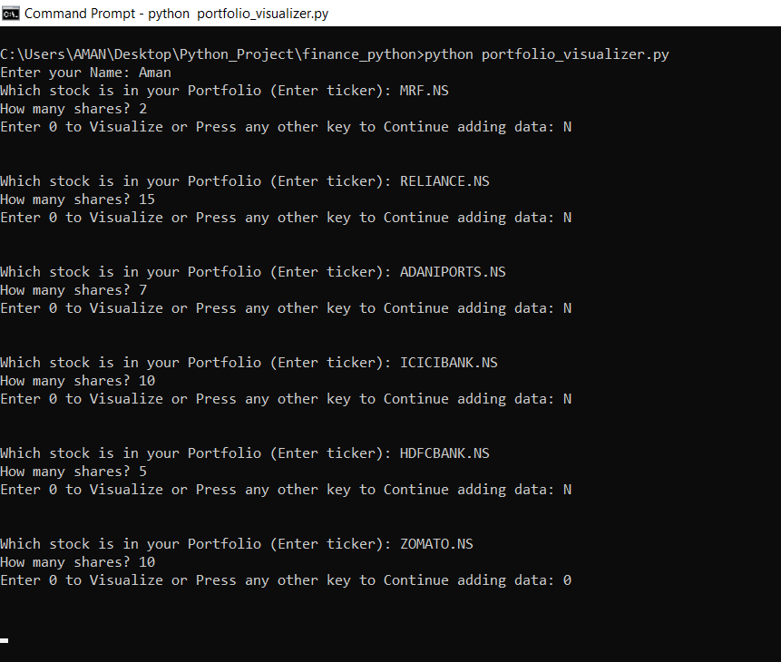

- Results 
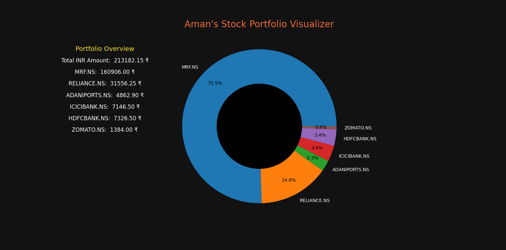

Note: Enter proper ticker name to avoid errors.

## [Stock Option](https://github.com/amanpanditap/Python_Projects/tree/main/finance_python/stock_option)
An option is a contract giving the buyer the right, but not the obligation, to buy (in the case of a call) or sell (in the case of a put) the underlying asset at a specific price on or before a certain date.

Read more [here](https://www.investopedia.com/options-basics-tutorial-4583012).

Command to Run: `python stock_option.py`

- Results 
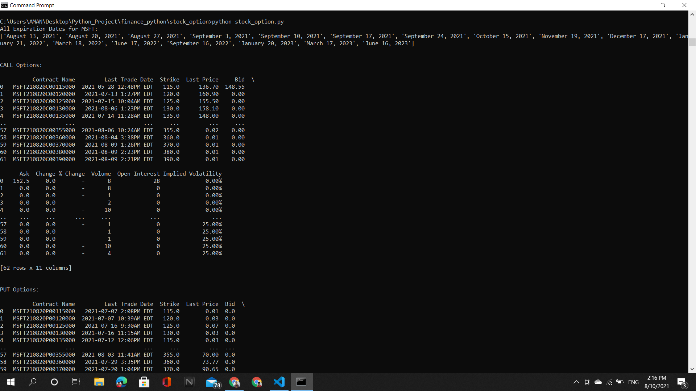
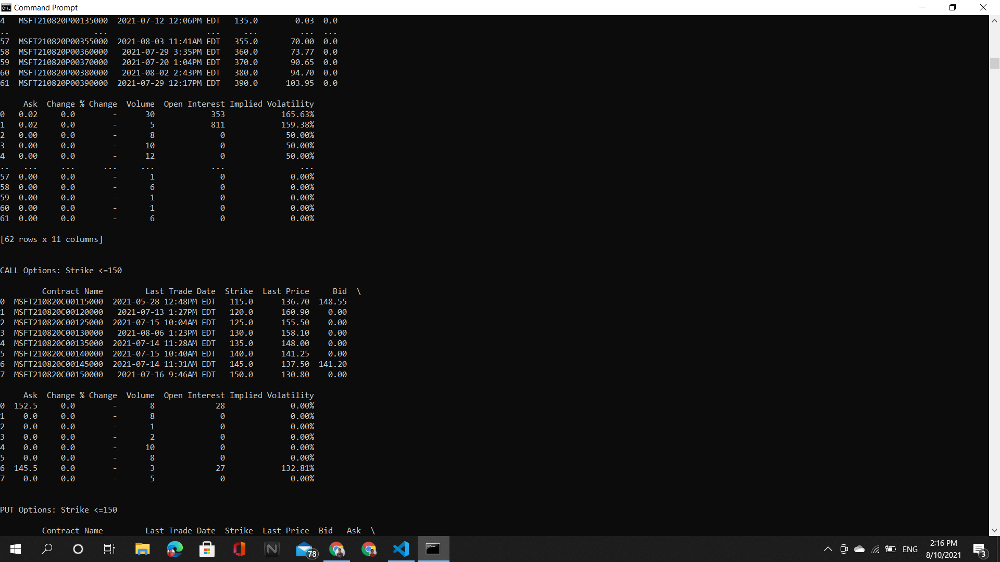
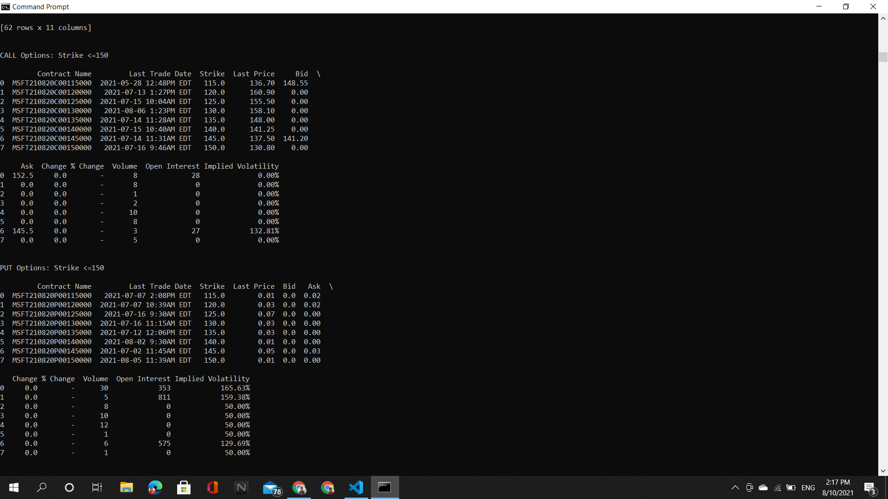

Note: Enter proper ticker name to avoid errors.

## [Stock / Crypto Prediction](https://github.com/amanpanditap/Python_Projects/tree/main/finance_python/stock_prediction)
Predict Closing Price of Next Day of a Stock / Cryptocurrency.

Command to Run: `python stock_prediction.py` 

- Stock Prediction Results 
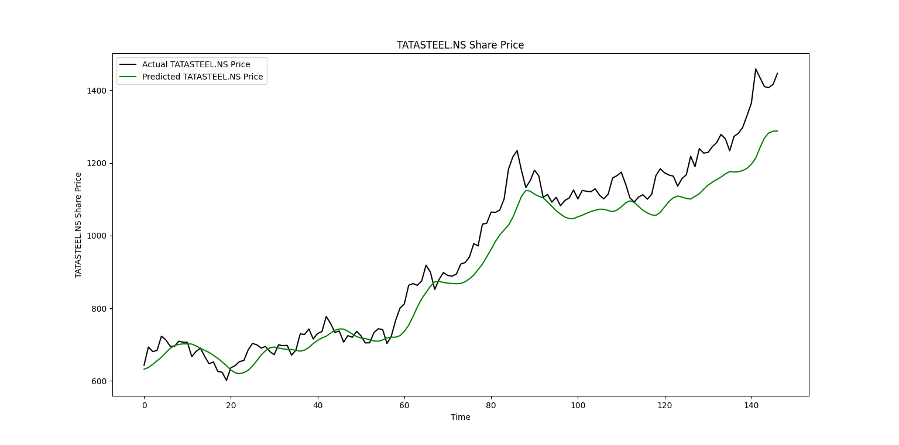

- Crypto Prediction Results 
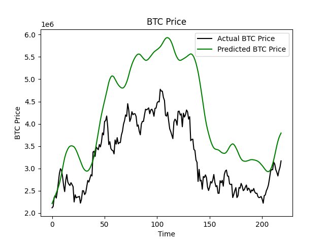

Note: Enter proper ticker name to avoid errors.

## [Stock Screener](https://github.com/amanpanditap/Python_Projects/tree/main/finance_python/stock_screener)
Simple Stock Screener is a tool that allows you to look through a bunch of different stocks and find the ones that match your criteria that you determine in advance.

Command to Run: `python stock_screener.py` 

Wait for some time for result to display, as it deals with multiple data at same time. 

- Stock Screening Results 
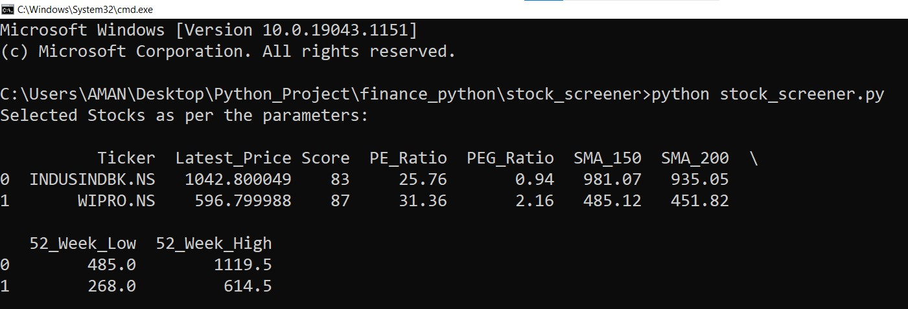

- [Final CSV File](https://github.com/amanpanditap/Python_Projects/tree/main/finance_python/stock_screener/final.csv)

## [Technical Stock Analysis](https://github.com/amanpanditap/Python_Projects/tree/main/finance_python/technical_stock_analysis)
What Is the Relative Strength Index (RSI)? 
Relative Strength Index is an overbought/oversold indicator that attempts to predict trend reversal points. RSI is based on the observation that a stock which is advancing will tend to close nearer to the high of the day than the low. The reverse is true for declining stocks. This indicator can also be used when comparing two different equities on a relative basis. RSI's absolute levels are 0 and 100. Buy signals are triggered at 30, and sell signals are triggered at 70. One of the important aspects of RSI is to look for divergence between price action and RSI. Upward sloping price and downward sloping RSI should be taken as a warning.

Detailed info, Read [here](https://www.investopedia.com/terms/r/rsi.asp). 
For more, Read [here](https://www.investopedia.com/articles/active-trading/042114/overbought-or-oversold-use-relative-strength-index-find-out.asp). 

Command to Run: `python technical_stock_analysis.py` 

- Results 
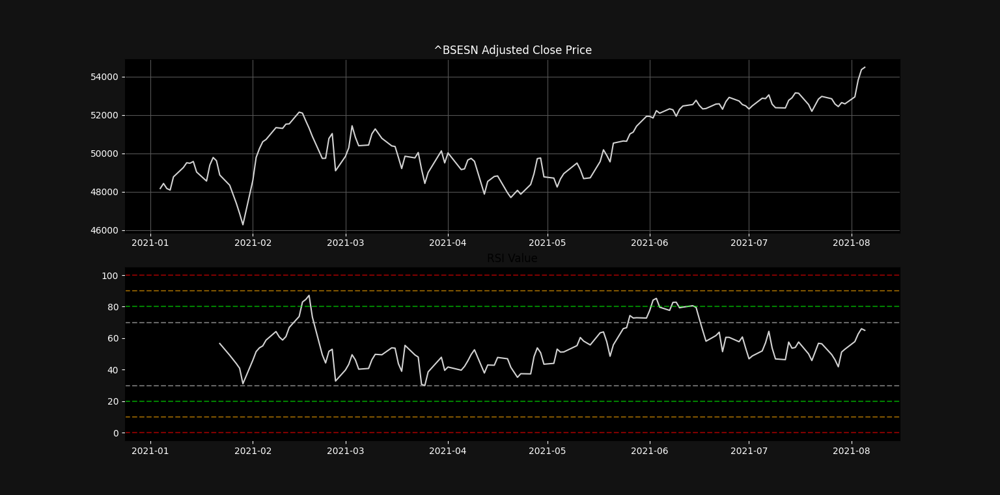

Note: Enter proper ticker name to avoid errors.